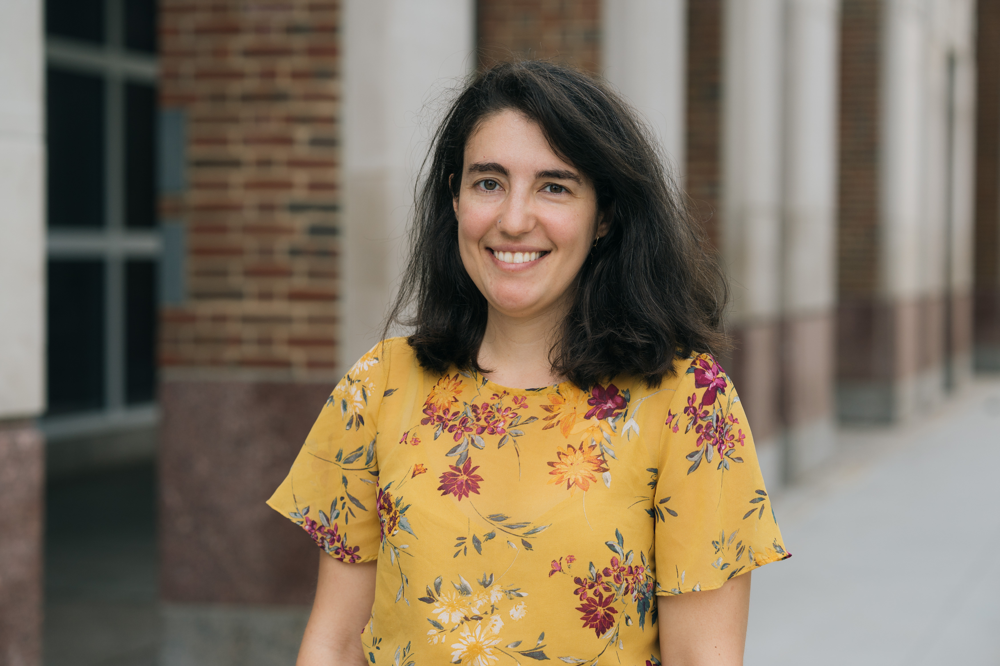

<!--   -->

Je suis une chercheuse postdoctorale en combinatoire à l'université [**Dartmouth College**](https://math.dartmouth.edu), située dans la ville de Hanover, au New Hampshire. J'ai obtenu mon **doctorat en mathématiques combinatoires** à l'Université du Québec à Montréal sous la direction de [Franco Saliola](http://lacim.uqam.ca/~saliola/).

J'ai aussi été **chroniqueuse de mathématiques** à l'émission de radio **[_L'oeuf ou la poule_](https://www.choq.ca/emissions-details/loeuf-ou-la-poule/)**.

Pour en connaître davantage sur mon **projet de doctorat** et mes projets de recherche, consulter la section [Recherche](recherche). Pour connaître mes **activités de diffusion des mathématiques vers un public plus général**, voir la section [Vulgarisation](vulgarisation).

Mary Versa Clemens-Sewall, une récente diplômée de Dartmouth College, a écrit [cette courte biographie de moi (en anglais)](https://awm-math.org/awards/student-essay-contest/2020-student-essay-contest-results/2020-student-essay-contest-college-hon-mention-1/) pour le concours de biographie de l'Association for Women in Mathematics, ce qui lui a valu une mention d'honneur. Toutes mes félicitations!

## Pour me contacter :

[prenom].[nom_de_famille]@dartmouth.edu

Dartmouth College  
Kemeny Hall   
Room 318

