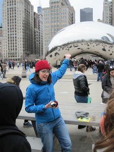

<!--   -->

Je suis professeure adjointe à l'[**Université Concordia**](https://www.concordia.ca/artsci/math-stats.html), employée pour une durée déterminée. J'ai obtenu mon **doctorat en mathématiques combinatoires** à l'Université du Québec à Montréal sous la direction de [Franco Saliola](https://saliola.github.io/). Avant d'être à Concordia, j'ai été chercheuse postdoctorale en combinatoire à l'université [Dartmouth College](https://math.dartmouth.edu), au New Hampshire. 

Je suis membre du comité éditorial de la revue **[Accromath](https://accromath.uqam.ca)**, qui s'adresse surtout aux étudiantes et étudiants ainsi qu'au corps professoral des cégeps et des écoles secondaires. J'ai aussi été **chroniqueuse de mathématiques** à l'émission de radio **[_L'oeuf ou la poule_](https://www.choq.ca/emissions-details/loeuf-ou-la-poule/)**.

Je détaille dans [cette courte vidéo](https://www.youtube.com/watch?v=LL_dat6_4e8) ma vision des mathématiques et de ce que j'espère pour les femmes en maths à l'avenir.
Mary Versa Clemens-Sewall, une récente diplômée de Dartmouth College, a écrit [cette courte biographie de moi (en anglais)](https://awm-math.org/awards/student-essay-contest/2020-student-essay-contest-results/2020-student-essay-contest-college-hon-mention-1/) pour le concours de biographie de l'Association for Women in Mathematics, ce qui lui a valu une mention d'honneur. Toutes mes félicitations!

## Pour me contacter :

[prenom].[nom_de_famille]@concordia.ca
