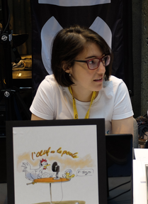

I'm involved in popularizing mathematics among diverse audiences. For each activity that I lead, no advanced knowledge of mathematics is required.

## For everyone
I have been a **mathematics guest-host** in the **radio show [_L'oeuf ou la poule_](http://www.loeufoulapoule.org)** (in French). With Stéphanie Schanck (and previously with [Élise Vandomme](http://lacim.uqam.ca/~elise.vandomme/index_en.html)), I present every month 7 minutes about mathematical news, a puzzle or a research problem. And this takes part in a show with other passionate scientists! You can listen to [some chronicles](http://loeufoulapoule.org/category/chroniques/maths/) or [all the shows](http://www.choq.ca/emissions-details/loeuf-ou-la-poule/) online.

Stéphanie Schanck and I also designed and ran the **[Maths in the city walking tour](http://coeurdessciences.uqam.ca/component/eventlist/details/765-maths-en-ville.html) (in French)**. For the last four years, we have used this as an opportunity to present downtown Montreal the way mathematicians see it. This is for adults or teenagers. I also designed a similar activity in Chicago and Trois-Rivières.

For the last couple editions of the [24 hours of science](https://science24heures.com/en/) in Montreal, I presented with [Pauline Hubert](http://phubert.github.io), Mélodie Lapointe, and Fanny Desjardins an activity for an audience of all ages. This was meant to break open the secrets of the **mathematics of magic tricks**, where amazement meets math learning.

## Are you a teacher? **Invite me in your classroom!**

**For high school students**, I give, with the support of the [Institut des Sciences mathématiques](http://ism.uqam.ca/outreach/#1492) a conference on _[How mathematics can help you finding the perfect partner](maths-de-l-amour.pdf)_! The [_Maths en ville_ walking tour](http://coeurdessciences.uqam.ca/balades-scientifiques-groupes-scolaires.html) is a perfect activity for high schoolers living in Montreal. Also about cities, I really like to talk about traffic, notably about the [Braess's paradox](Braesss-paradox.pdf).

**For elementary and middle school students**, I designed a mathematical play called [_L'été, c'est mathématique!_](http://coeurdessciences.uqam.ca/component/eventlist/details/710-l-ete-c-est-mathematique.html) with Émile Nadeau. Independently, I also have workshops about mathematical aspects of magic and graph theory that are ready to present.

