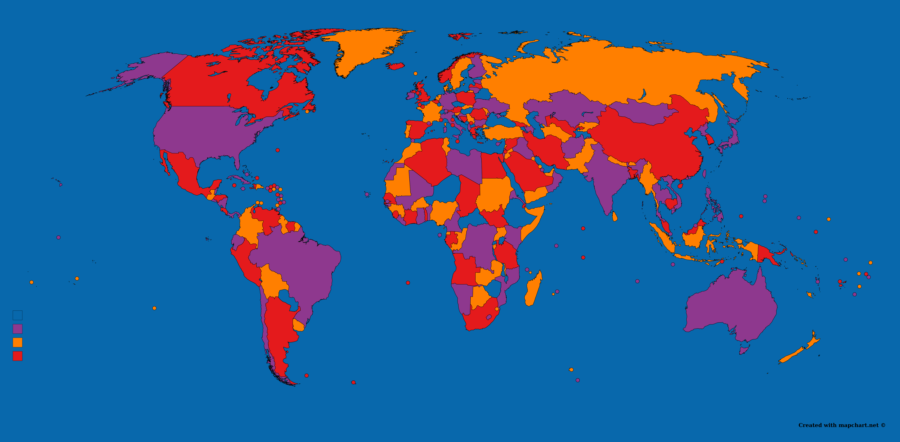

## Des mathématiques assistées par le logiciel [SageMath](https://www.sagemath.org)

Dans le cadre de ma recherche, mais aussi pour des cours et des projets de vulgarisation, j'utilise beaucoup le logiciel libre SageMath. C'est un logiciel libre (open source et gratuit) développé par une communauté de mathématicien-ne-s très dynamique!

### Utiliser SageMath
Les principales options pour utiliser SageMath sont un serveur en ligne ([CoCalc](https://cocalc.com)) et l'installation sur son ordinateur ([instructions et téléchargement](http://www.sagemath.org/download.html)). Je conseille la deuxième option.

Une fois SageMath installé sur votre ordinateur, vous pouvez télécharger les feuilles d'introduction plus bas. Pour les ouvrir, la procédure ressemble à ceci~:
 * Enregistrer une feuille de travail sur son ordinateur
 * Démarrer le carnet de notes SageMath (par exemple, avec la commande 'CHEMIN_VERS_LE_DOSSIER_SAGE/./sage --notebook=jupyter' à partir du dossier dans lequel se trouve la feuille de travail). SageMath s'ouvrira dans votre navigateur.
 * Dans le navigateur, sélectionner la feuille de travail.

### Quelques feuilles d'introduction
 * Feuille 1 - Intro [en français](sage_ws/Atelier_1_sans_les_solutions.ipynb), [in English](sage_ws/Short_intro.ipynb)
 * Feuille 2 - [Bases en Python](sage_ws/Atelier_2_sans_les_solutions.ipynb)
 * Feuille 3 - [Algèbre linéaire](sage_ws/Atelier_3_sans_les_solutions.ipynb)
 * Feuille 4 - [Théorie de la représentation](sage_ws/Atelier_4_sans_les_solutions.ipynb)
 * [Une introduction aux mélanges de cartes avec SageMath!](sage_ws/Melanges_de_cartes.ipynb)
Pour les solutions de ces feuilles de travail, écrivez-moi!

Franco Saliola a aussi [de bonnes feuilles d'introduction à SageMath](http://lacim.uqam.ca/~saliola/sage/tutorials/). Pour plus de défis, je vous conseille d'essayer certains des défis du [Projet Euler (seulement en anglais)](https://projecteuler.net/).

### SageTeX
Un outil que je trouve très pratique sert à appeler SageMath à partir de LaTeX. Il s'appele SageTeX, et je rends disponibles mes [notes sur son utilisation](sage_ws/sagetex.pdf).

### Quatre couleurs avec SageMath
Une belle image réalisée avec l'aide de SageMath, illustrant le  [théorème des quatre couleurs](https://fr.wikipedia.org/wiki/Th%C3%A9or%C3%A8me_des_quatre_couleurs). Défi : Trouver le lac qui n'est pas la même couleur que l'océan.

### Développer pour SageMath
Vous ne trouvez pas toutes les fonctionnalités voulues dans SageMath? [Contribuez au logiciel](http://doc.sagemath.org/html/en/developer/) ou participez aux [journées SageMath](https://wiki.sagemath.org/Workshops).
