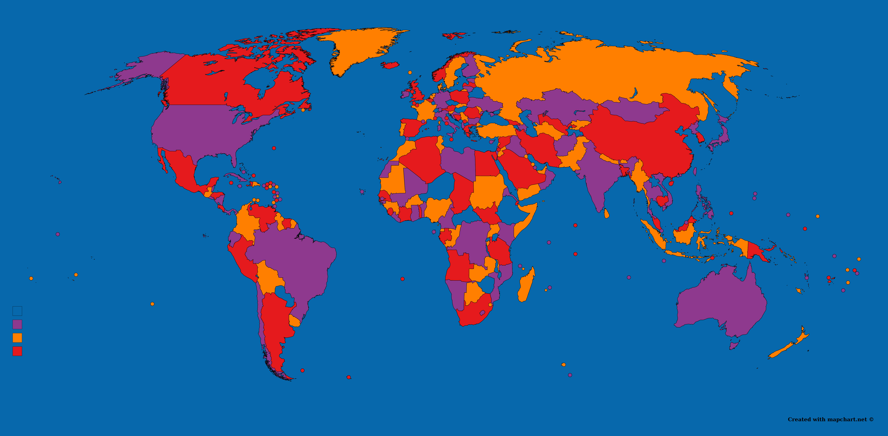

## Computer assisted mathematics with [SageMath](https://www.sagemath.org)

For my research, as well as for teaching or outreach projects, I use SageMath. This is an open-source software developed by a dynamical community of mathematicians!

### Using  SageMath
The main options to use SageMath are an online server ([CoCalc](https://cocalc.com)) or the local installation on a computer ([instructions and download](http://www.sagemath.org/download.html)). I suggest the latter.

Once SageMath is installed on your computer, you can download the introductory worksheets posted below. To open Sagemath in its notebook, the procedure is the following:
 * Depending on your operating system and the version of SageMath you installed, this can either be done with a button in your menu, or from the command line, by typing ‘PATH_TO_THE_SAGE_FOLDER/sage --notebook=jupyter’ from the folder in which the worksheet is located. Then, SageMath should open in your browser.
 * In your browser, you should find the SageMath (Jupyter) notebook interface. Simply open the worksheet by clicking on it.

### Combinatorics with SageMath at ICTP-EAUMP School on Enumerative Combinatorics
I was a lecturer at the [2023 ICTP-EAUMP School on Enumerative Combinatorics](https://indico.ictp.it/event/10188/) in Arusha, Tanzania, a school in partnership with CIMPA happening each year in East Africa (on rotating topics). My course was on using SageMath for combinatorics. You can download individual lectures (with exercises) or a Zip file containing all the material.
 * Day 1: Introduction to SageMath + worksheets on using SageMath as a calculator and Python basics (including solutions) - as a [Zip file](Sage_course_Arusha/Lecture1.zip)
 * Day 2: Combinatorial structures in SageMath + worksheet on some number sequences (including solutions) - as a [Zip file](Sage_course_Arusha/Lecture2.zip)
 * Day 3: Generating functions with SageMath + worksheet (including solutions) - as a [Zip file](Sage_course_Arusha/Lecture3.zip)
 * Day 4: Graph Theory with SageMath + worksheet (no solution) - as a [Zip file](Sage_course_Arusha/Lecture4.zip)
 * Day 5: Databases and the bijectionist's tool kit  - no exercises, slides only. As a [Zip file](Sage_course_Arusha/Lecture5.zip)
 * The whole minicourse, as a [Zip file](Sage_course_Arusha/AllLectures.zip)

### Some (old) introductory worksheets - Worked with old versions of SageMath
These worksheets were prepared for various events and worked with previous versions of SageMath. They might not work with the current version.
 * Worksheet 1 - Intro [in English](sage_ws/Short_intro.ipynb) or [en français](sage_ws/Atelier_1_sans_les_solutions.ipynb)
 * Worksheet 2 - [Python Basics](sage_ws/2-Python_basics_no_solutions.ipynb)
 * Worksheet 3 - [Linear Algebra](sage_ws/3-Linear_algebra.ipynb)
 * Worksheet 4 - [Guessing generating functions with Sage](sage_ws/Guessing_with_Sage.ipynb)

More worksheets can be found on the French page, but they are in French.
For the solutions to these worksheets, email me.

For more challenges, I suggest you try the challenges from the [Euler Project](https://projecteuler.net/).

### Four colors with SageMath
A nice picture realized with the use of SageMath, picturing the [Four Color Theorem](https://en.wikipedia.org/wiki/Four_color_theorem). Here's a challenge: Find the lake that is not the same color as the oceans.

### Contribute to SageMath
You don't find the features you are looking for in SageMath? [Contribute to it](http://doc.sagemath.org/html/en/developer/) or go to [SageMath Days](https://wiki.sagemath.org/Workshops).
