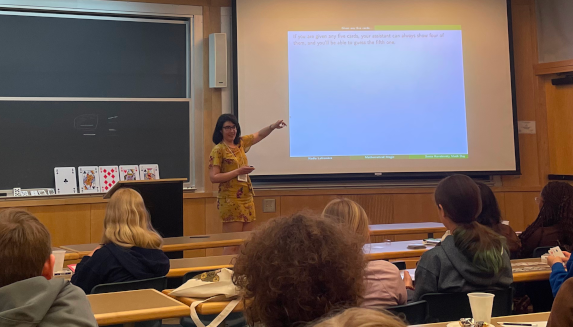
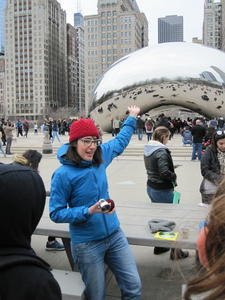

Je suis impliquée dans la vulgarisation des mathématiques auprès d'une diversité de publics. Pour chacun de ces ateliers, aucune connaissance avancée des mathématiques n'est requise.

Je fais également partie du comité éditorial de la [revue **Accromath**](https://accromath.uqam.ca/), accessible en ligne et en papier.

## Pour tous
J'ai été, de 2015 à 2019 **chroniqueuse de mathématiques** à l'**émission de radio [_L'oeuf ou la poule_](https://www.choq.ca/emissions-details/loeuf-ou-la-poule/)**. Avec Stéphanie Schanck (et quelques fois avec Élise Vandomme), nous présentions chaque mois des segments radio de 7 minutes sur un sujet d'actualités ou un problème mathématique. Le tout a eu lieu dans une émission concoctée par des scientifiques passionné.es! Vous pouvez réécouter [toutes les émissions](http://www.choq.ca/emissions-details/loeuf-ou-la-poule/) en ligne.

Avec Stéphanie Schanck, on a aussi mis sur pied les **[balades Maths en ville](http://coeurdessciences.uqam.ca/component/eventlist/details/765-maths-en-ville.html)**, présentées à un public adulte ou adolescent depuis plus 2015. Il s'agit d'une promenade au centre-ville où nous invitons chaque personne à regarder la ville avec des lunettes mathématiques. Chaque été, nous sommes plusieurs guides à présenter cette activité. Pour en savoir plus sur la balade Maths en ville, vous pouvez consulter les reportages faits par [Le Devoir](https://www.ledevoir.com/vivre/560780/la-balade-maths-en-ville-devoile-montreal-sous-un-angle-mathematique), [La Presse +](http://plus.lapresse.ca/screens/8cf33e5b-e559-4865-9fe2-55ddac82f84e__7C___0.html) et [Ici Première](http://ici.radio-canada.ca/emissions/les_annees_lumiere/2015-2016/chronique.asp?idChronique=410900). On parle nous-même des avantages pédagogiques de la balade dans [Enjeux et Société](https://www.erudit.org/fr/revues/enjeux/2019-v6-n2-enjeux05076/1066702ar/). La balade est 
maintenant guidée par des étudiantes et étudiants de l'UQAM.

Lors de quelques éditions du 24 heures de sciences, j'ai présenté avec [Pauline Hubert](http://phubert.github.io), [Mélodie Lapointe](https://lapointemelodie.github.io/) et Fanny Desjardins une activité pour démystifier les **mathématiques de la magie**, où on surprend le public, sans toutefois le laisser sur sa faim! J'ai également animé un atelier similaire en solo pour un public adolescent.

## Vous êtes enseignante ou enseignant? **Invitez-moi en classe!**

**Au niveau collégial**, je propose par le biais de [l'Institut des Sciences mathématiques](http://ism.uqam.ca/accueil/outreach/#1492) des conférences sur _[Comment les mathématiques peuvent vous aider à trouver l'âme soeur](maths-de-l-amour.pdf)_, sur le [paradoxe de Braess](Braesss-paradox-fr.pdf) et sur _Tricher à l'aide des mathématiques_. La [balade _Maths en ville_](http://coeurdessciences.uqam.ca/balades-scientifiques-groupes-scolaires.html) se prête aussi très bien à un public de niveau collégial.

**Au niveau secondaire**, j'ai réalisé et animé pendant des années la [balade _Maths en ville_](http://coeurdessciences.uqam.ca/balades-scientifiques-groupes-scolaires.html) à des groupes d'écoles secondaires en visite au centre-ville.

**Au niveau primaire**, j'ai présenté avec le Coeur des Sciences la pièce de théâtre [_L'été, c'est mathématique!_](http://coeurdessciences.uqam.ca/component/eventlist/details/710-l-ete-c-est-mathematique.html) En solo, je peux aussi présenter un atelier sur la théorie des graphes. Enfin, l'activité _Maths et magie_ se prête bien à un public de tous les niveaux primaires.

